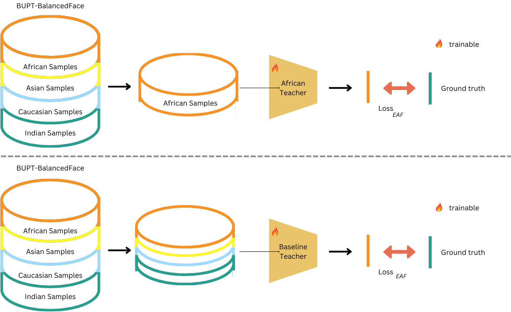
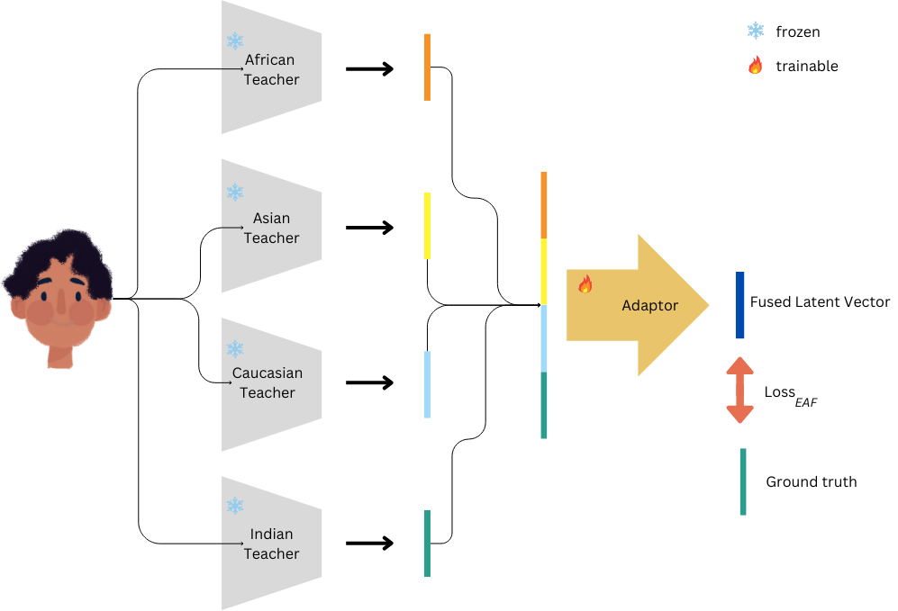
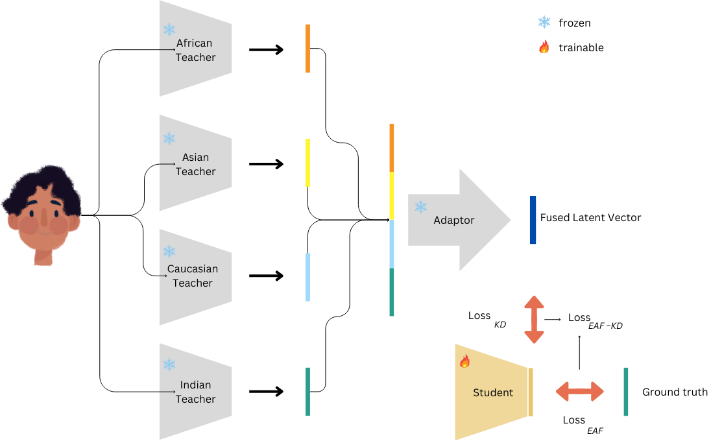

# MST-KD: Multiple Specialized Teachers Knowledge Distillation for Fair Face Recognition
Official repository for the paper **[MST-KD: Multiple Specialized Teachers Knowledge Distillation for Fair Face Recognition]**(https://arxiv.org/abs/2408.16563).

## Abstract
As in school, one teacher to cover all subjects is insufficient to distill equally robust information to a student. Hence, each subject is taught by a highly specialised teacher. Following a similar philosophy, we propose a multiple specialized teacher framework to distill knowledge to a student network. In our approach, directed at face recognition use cases, we train four teachers on one specific ethnicity, leading to four highly specialized and biased teachers. Our strategy learns a project of these four teachers into a common space and distill that information to a student network. Our results highlighted increased performance and reduced bias for all our experiments. In addition, we further show that having biased/specialized teachers is crucial by showing that our approach achieves better results than when knowledge is distilled from four teachers trained on balanced datasets. Our approach represents a step forward to the understanding of the importance of ethnicity-specific features.

## Code Usage
Here we summarize the steps replicate the work presented in the paper. The mentioned hyperparameters can be altered in the file config/config.py and **should be changed there** (some hyperparameters should be changed at specific steps to exactly mimic the paper results).

1. Run baseline_data_split.py four times (changing the cfg.ethnicity parameter) to perform a balanced datasplit of the trainset in four groups. Each subset will be used to train one of the four baseline teachers
2. Run train.py to train each of the teacher models. This script should be ran four times to obtain the four teacher models, changing the cfg.ethnicity parameter. To train the baseline teachers, set cfg.is_teacher_baseline to True
3. Run extract_all for the four ethnicities by changing the cfg.ethnicity parameter
4. To obtain the adaptors:
    - Run fc_EArc.py once to obtain SL-EAF-Fusion
    - Run dual_layer_EAF-Fusion.py twice to obtain DuL-EAF-Fusion (setting cfg.has_dropout=False) and DLDPO-EAF-Fusion (setting cfg.has_dropout=True)
5. To obtain the students, run KD_alone.py (for a-KD) or KD_CEL.py (for EAF-KD) with each of the following configurations:
    - Set cfg.is_dual_layer to False to obtain SL-EAF-Fusion students
    - Set cfg.is_dual_layer to True and cfg.has_dropout to False to obtain DuL-EAF-Fusion students
    - Set cfg.is_dual_layer to True and cfg.has_dropout to True to obtain DLDPO-EAF-Fusion students

## Training Stages

### Teachers
 

We use multiple teachers to distill knowledge to a student since specializing each teacher in distinguishing identities from a single ethnicity may facilitate the distillation of ethnicity-specific knowledge, boosting student performance and fairness. Hence, each of the four teachers was trained on the 7k identities of one of the considered ethnicities: African, Asian, Caucasian and Indian. These models are expected to perform better for identities from the ethnicity they were trained with since they are more familiar with their ethnicity-dependent attributes. To demonstrate that the effectiveness of the suggested approaches rely on the fact that information is being distilled from ethnicity-specialized teachers, a multi-teacher baseline was also trained on balanced subsets of the original dataset.

### Adaptors


Since knowledge is being transferred from more than one teacher, there is the need to adapt the four teachers' feature spaces to a common multi-teacher space from where knowledge can be directly distilled to the student. This can be achieved by training an adaptor network that simultaneously projects values from the four hyperspheres to a common one. To consider the information extracted by the four teachers simultaneously, their embeddings are concatenated to form a 2048-D vector that is inputted to the adaptor backbone. This vector contains four 512-D blocks corresponding to the features extracted by the teacher trained with samples of each ethnicity. This means that all teacher outputs are similarly weighted when the input vector is appended but their projection to the new hypersphere is learned.

### Students
 

The knowledge of the multi-teacher space is integrated into the student's learning process by means of a KD loss, $L_{KD}$, which minimizes the MSE between the embeddings extracted by the student and the multi-teacher space. 

The student models assessed in this study fall into two groups: students trained with KD and the ElasticArcFace loss (EAF-KD) and students trained with KD alone (a-KD). a-KD does not require access to the identity labels of the training data resulting in a more privacy-friendly setting.

## Final Models
The models mentioned in the paper (teachers, adaptors and students) can be found [here](https://drive.google.com/file/d/1nqw7OuPGTW9hgWNE2q-GCCK904VtKkZh/view?usp=sharing).

## Citation
If you use our work in your research, please cite with:

```
@misc{caldeira2024mstkdmultiplespecializedteachers,
      title={MST-KD: Multiple Specialized Teachers Knowledge Distillation for Fair Face Recognition}, 
      author={Eduarda Caldeira and Jaime S. Cardoso and Ana F. Sequeira and Pedro C. Neto},
      year={2024},
      eprint={2408.16563},
      archivePrefix={arXiv},
      primaryClass={cs.CV},
      url={https://arxiv.org/abs/2408.16563}, 
}
```
